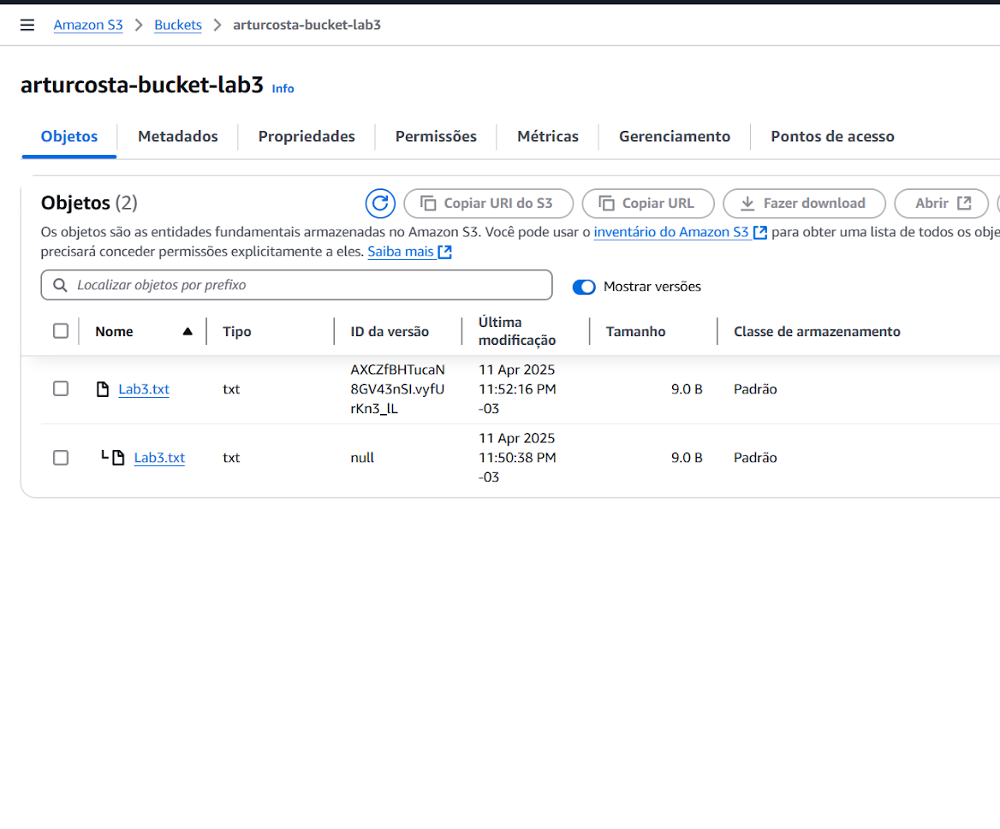
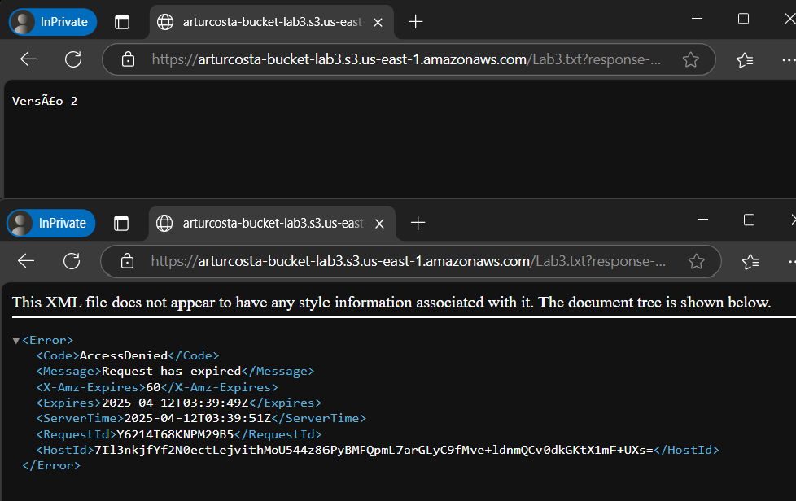

# Laboratório: Amazon S3 Básico e Avançado

Este repositório documenta a execução do laboratório prático sobre funcionalidades básicas e avançadas do Amazon S3, realizado como parte dos estudos para a certificação AWS Certified Solutions Architect - Associate na **Escola da Nuvem**.

O objetivo foi explorar e implementar recursos chave para segurança, governança e otimização de custos no S3.

**Instrutor:** João Gaioso ([@Gaiosojoao](https://github.com/Gaiosojoao))
**Aluno:** Artur Costa ([@arturcosta86](https://github.com/arturcosta86))

---

## 🎯 Objetivos do Laboratório

O foco deste projeto prático foi aprender a utilizar e configurar os seguintes recursos do Amazon S3:

* **Versionamento:** Manter um histórico de todas as versões de um objeto, permitindo a recuperação de dados em caso de exclusões ou modificações acidentais.
* **Regras de Ciclo de Vida:** Automatizar a movimentação de objetos entre diferentes classes de armazenamento (por exemplo, de S3 Standard para S3 Glacier) para otimizar custos.
* **URLs Pré-Assinadas:** Gerar links de acesso temporário e seguro a objetos específicos em um bucket privado.

---

## 🛠️ Cenário e Metodologia

O cenário proposto foi o de um responsável pelo armazenamento em nuvem que precisa garantir a segurança, organização e otimização de custos dos dados da empresa.

Para isso, as seguintes tarefas foram executadas:

1.  **Criação de um Bucket S3:** Foi criado um bucket privado na região `us-east-1` (Norte da Virgínia).
2.  **Upload de Objeto:** Um arquivo de texto (`Lab3.txt`) foi criado e carregado no bucket.
3.  **Habilitação do Versionamento:** O versionamento foi ativado no bucket. Em seguida, uma nova versão do `Lab3.txt` foi carregada para demonstrar o histórico.
4.  **Configuração do Ciclo de Vida:** Foi criada uma regra para mover objetos para a classe de armazenamento `Glacier Instant Retrieval` após 30 dias.
5.  **Geração de URL Pré-Assinada:** Foi gerada uma URL temporária (com validade de 1 minuto) para o objeto `Lab3.txt`, permitindo o acesso seguro a partir de um navegador em modo anônimo.

---

## ✅ Evidências da Implementação

A seguir estão as capturas de tela que comprovam a execução bem-sucedida das tarefas do laboratório.

### 1. Versionamento de Objetos no S3
* **Descrição:** A imagem mostra o bucket `arturcosta-bucket-lab3` com a opção "Mostrar versões" ativada. São visíveis duas versões distintas do arquivo `Lab3.txt`, cada uma com um "ID da versão" único, demonstrando que o versionamento está funcionando corretamente.

### 2. Teste da URL Pré-Assinada
* **Descrição:** Esta evidência mostra dois momentos do teste da URL pré-assinada:
    * **Acesso Permitido (Topo):** A primeira janela do navegador mostra o conteúdo do arquivo ("Versão 2"), indicando que a URL pré-assinada funcionou dentro do seu tempo de validade.
    * **Acesso Expirado (Abaixo):** A segunda janela mostra uma mensagem de erro "AccessDenied" com o detalhe "Request has expired". Isso comprova que, após o tempo de expiração de 1 minuto, a mesma URL deixou de ser válida, conforme o esperado.

